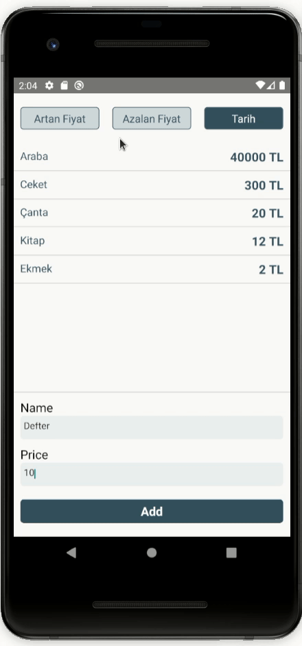

# first_homework

 

## Running Project

In this project, I created an App according to the homework. Write product name and price and push add button to add list. You can also sort the list by price ascending, price descending and by date added.

After the project is downloaded, the project is opened with the 'Visual Studio Code' editor.

At the terminal;
```
npm install

```
The packages used in the project with the command line are created in the "node_modules" folder.
```
npx react-native start
```
command is run.
```
npx react-native run-android
```
command is run.

If you see white screen, close App and open it again on emulator.